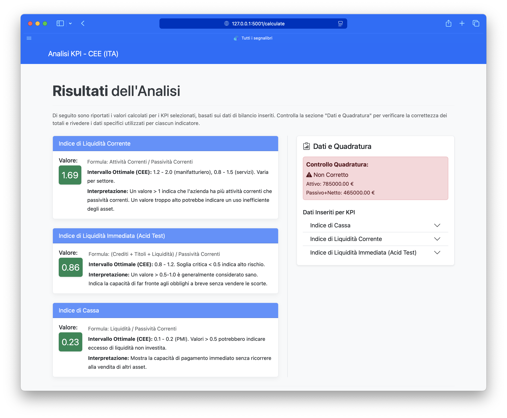

<!-- An English version of this README is available here: [README.en.md](./README.en.md) -->

# italian-gaap-kpi-analyzer (Calcolatore KPI per Bilanci Italiani) - Versione 0.3.x

<!-- Badge: Licenza, Versione Python, Versione Flask -->


**Un'applicazione web per calcolare gli Indicatori Chiave di Prestazione (KPI) da bilanci conformi ai principi contabili italiani (OIC, formato CEE).**

## Indice
- [Informazioni sul Progetto](#informazioni-sul-progetto)
- [Funzionalità](#funzionalità)
- [Screenshot Dimostrativi](#screenshot-dimostrativi)
- [Guida all'Installazione](#guida-allinstallazione)
- [Come si Usa](#come-si-usa)
- [Creare il Proprio Eseguibile](#creare-il-proprio-eseguibile)
- [Documentazione](#documentazione)
- [Dipendenze](#dipendenze)
- [Licenza](#licenza)
- [Contribuire](#contribuire)
- [Sviluppo](#sviluppo)
- [CI/CD Pipeline (Rilasci Automatici)](#cicd-pipeline-rilasci-automatici)
- [Roadmap / Sviluppi Futuri](#roadmap--sviluppi-futuri)
- [Contatti](#contatti)

## Informazioni sul Progetto

KPI CEE è uno strumento web basato su Flask pensato per analisti finanziari, commercialisti, studenti e imprenditori. Semplifica l'analisi dei bilanci calcolando automaticamente i principali indicatori finanziari (KPI) secondo la struttura definita dal Codice Civile Italiano (Art. 2424 - formato CEE).

Il progetto è open source, gratuito da usare, modificare e distribuire. Usalo come strumento di apprendimento, calcolatore rapido o adattalo alle tue esigenze!

## Funzionalità

- **Conformità ai Principi Contabili Italiani (OIC):** Strutturato secondo il formato CEE ufficiale.
- **Calcolo di molteplici KPI:** Inclusi Current Ratio, Quick Ratio, Debt to Equity e altri.
- **Interfaccia Web Intuitiva:** Seleziona facilmente i KPI e inserisci i dati di bilancio.
- **Risultati Dettagliati:** Visualizza i KPI calcolati con interpretazioni.
- **Esportazione PDF:** Stampa i risultati (sintesi o report completo) direttamente dal browser.

## Screenshot Dimostrativi

Di seguito alcuni screenshot che illustrano le principali funzionalità e il flusso di lavoro dell'applicazione:

*I dati utilizzati negli screenshot sono disponibili nella cartella `demo-screenshots/data`.*

### Selezione KPI


*Scegli quali KPI calcolare dall'elenco disponibile.*

### Selezione KPI (Scorrimento)


*Vista della pagina di selezione KPI dopo aver effettuato lo scroll per vedere più opzioni.*

### Inserimento Dati


*Inserisci i dati di bilancio richiesti per il calcolo dei KPI.*

### Risultati


*Visualizza i KPI calcolati e le relative interpretazioni.*

## Guida all'Installazione

Ci sono due modi principali per utilizzare KPI CEE:

### 1. Utilizzo dei Rilasci Precompilati (Windows & Linux)

Scarica gli eseguibili già pronti per Windows e Linux. Per macOS si consiglia l'esecuzione dal codice sorgente (vedi sotto).

1. Vai alla **[pagina dei rilasci](https://github.com/VincenzoRocchi/kpi_cee/releases)**.
2. Scarica l'archivio per il tuo sistema operativo (es. `kpi_cee-windows.zip` o `kpi_cee-linux.tar.gz`).
3. Estrai l'archivio.
4. Avvia l'eseguibile `kpi_cee` presente nella cartella estratta.

Per istruzioni dettagliate e specifiche per il sistema operativo, consulta la **[Guida all'Installazione nei Docs](./docs/01_installation.md)** (Nota: le istruzioni per macOS potrebbero non essere aggiornate).

### 2. Esecuzione dal Codice Sorgente (Consigliato per macOS, valido anche per Windows/Linux)

Questo metodo offre maggiore flessibilità, permette di ricevere gli ultimi aggiornamenti ed è ideale se vuoi vedere o modificare il codice.

#### Installazione di `uv` (Gestore di pacchetti consigliato)

Si consiglia di utilizzare [`uv`](https://docs.astral.sh/uv/getting-started/installation/) per una gestione rapida dei pacchetti Python. Fai riferimento alla [guida ufficiale di installazione di uv](https://docs.astral.sh/uv/getting-started/installation/) o a un [tutorial su YouTube](https://www.youtube.com/results?search_query=python+uv+installer) per istruzioni aggiornate.

#### Passaggi di Setup

1. **Prerequisiti:**
    - **Python:** Si consiglia la versione 3.10 o superiore.
        - **macOS:** Il modo più semplice per installare Python è tramite [Homebrew](https://brew.sh/). Una volta installato Homebrew, esegui: `brew install python`
        - **Windows/Linux:** Scarica Python dal [sito ufficiale](https://www.python.org/downloads/) o usa il gestore pacchetti del tuo sistema (es. `apt` su Debian/Ubuntu).
    - **Git:** Per clonare il repository ([Guida all'installazione di Git](https://git-scm.com/book/en/v2/Getting-Started-Installing-Git)).

2. **Clona il repository:**

    ```bash
    git clone https://github.com/VincenzoRocchi/kpi_cee.git
    cd kpi_cee
    ```

3. **Crea un ambiente virtuale Python:**
    - **Con `uv` (consigliato):**

        ```bash
        uv venv
        # Attiva l'ambiente virtuale (uv mostrerà il comando, di solito:)
        # Su macOS/Linux: source .venv/bin/activate
        # Su Windows: .venv\Scripts\activate
        ```

    - **Con `venv` standard:**

        ```bash
        python -m venv venv
        # Su Windows: venv\Scripts\activate
        # Su macOS/Linux: source venv/bin/activate
        ```

4. **Installa le dipendenze:**
    - **Con `uv` (consigliato, installa da `pyproject.toml`):**

        ```bash
        uv pip install -e .
        ```

    - **Con `pip` (installa Flask da `requirements.txt`):**

        ```bash
        pip install -r requirements.txt
        # Nota: Per strumenti di sviluppo come pytest e PyInstaller,
        # assicurati che siano installati separatamente se non usi il comando uv sopra,
        # o se in futuro verranno rimossi dalle dipendenze principali di pyproject.toml.
        ```

5. **Imposta `SECRET_KEY` (raramente necessario per uso locale):**
    Flask utilizza una `SECRET_KEY` per la gestione delle sessioni. L'applicazione genera automaticamente una chiave temporanea se non viene impostata, sufficiente per l'uso locale. Se necessario, puoi impostarla manualmente:
    - macOS/Linux (nel terminale):

        ```bash
        export SECRET_KEY='mia_chiave_locale'
        ```

    - Windows (Prompt dei comandi):

        ```bash
        set SECRET_KEY=mia_chiave_locale
        ```

6. **Avvia l'applicazione:**

    ```bash
    python app.py
    ```

    Apri il browser e vai su `http://127.0.0.1:5001`.

Per ulteriori dettagli, consulta la **[Guida all'Installazione per l'Esecuzione dal Sorgente](./docs/01_installation.md#option-2-running-from-source-code)**.

## Come si Usa

1. Dopo aver avviato l'applicazione, apri il browser e vai su `http://127.0.0.1:5001`.
2. Seleziona i KPI che vuoi calcolare dall'elenco.
3. Inserisci i dati di bilancio richiesti.
4. Visualizza i KPI calcolati e le relative interpretazioni nella pagina dei risultati.
5. Opzionalmente, esporta i risultati in PDF.

## Creare il Proprio Eseguibile

Se hai modificato il codice o vuoi creare un eseguibile personalizzato, puoi utilizzare PyInstaller.

Istruzioni dettagliate sono disponibili nella **[Guida alla compilazione dai sorgenti](./docs/02_building_from_source.md)**.

## Documentazione

Per informazioni più approfondite, inclusa la struttura del progetto e le linee guida per contribuire, visita la nostra **[Documentazione](./docs/README.md)**.

## Dipendenze

- Python 3.10+ (3.12 consigliato)
- Flask >=3.0.0
(Consulta `requirements.txt` per la versione esatta di Flask).

## Licenza

Questo progetto è distribuito secondo i termini descritti nel file [LICENSE](./LICENSE).

## Contribuire

Contributi, suggerimenti e segnalazioni di bug sono benvenuti! Consulta la nostra **[Guida per i contributori](./docs/04_contributing.md)** per maggiori dettagli.

## Sviluppo

Se vuoi contribuire o modificare il codice:

- Segui i passaggi della sezione "Esecuzione dal Sorgente" per configurare l'ambiente, preferibilmente usando `uv`.
- Se hai usato `uv pip install -e .` o hai installato il progetto da `pyproject.toml`, gli strumenti di sviluppo come `pytest` (per i test) e `PyInstaller` (per creare eseguibili) sono già installati.
- Esegui i test con Pytest:

    ```bash
    pytest
    ```

## CI/CD Pipeline (Rilasci Automatici)

Questo progetto utilizza GitHub Actions per compilare automaticamente gli eseguibili per Windows e Linux e creare un nuovo rilascio GitHub quando viene pubblicato un nuovo tag di versione (es. `v0.3.0`). Consulta il [workflow](./.github/workflows/release.yml) per i dettagli.

## Roadmap / Sviluppi Futuri

Funzionalità e miglioramenti previsti:
- Supporto multilingua (italiano/inglese)
- Possibile supporto per altri standard di bilancio (es. IFRS)
- Più mapping e possibilità di standardizzarli per vari casi d'uso
- Mapping personalizzabili dall'utente (l'utente può implementare la propria logica di mapping se necessario)

## Contatti

Per domande, supporto o suggerimenti, apri una issue sulla [pagina GitHub Issues](https://github.com/VincenzoRocchi/kpi_cee/issues) o contatta il maintainer tramite l'email indicata nel profilo del repository.
